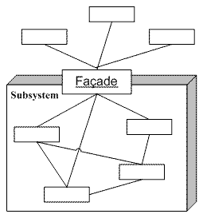

# 门面模式(Facade Pattern) 
 定义：Provide a unified interface to a set of interfaces in a subsystem. Facade defines a higher-level interface that makes the subsystem easier to use.（要求一个子系统的外部与其内部的通讯必须通过一个统一的对象进行。门面模式提供一个高层次的接口，使得子系统更易于使用。）  

门面模式注重“统一的对象”，也就是提供一个访问子系统的接口，除了这个接口不允许有任何访问子系统的行为方式。门面模式示意图如下图：  

 我们先明确一下门面模式的角色。

- Facade门面角色：客户端可以调用这个角色的方法。此角色知晓子系统的所有功能和责任。一般情况下，本角色会将所有从客户端发来的请求委派到相应的子系统去，也就说该角色没有实际的业务逻辑，只是一个委托类。
- subsystem子系统角色：可以同时有一个或者多个子系统。每一个子系统都不是一个单独的类，而是一个类的集合。子系统并不知道门面的存在。对于子系统而言，门面仅仅是另外一个客户端而已。

# 门面模式的应用
### 1.门面模式的优点
 * 减少系统的相互依赖。
 * 提高了灵活性。不管子系统内部如何变化，只要不影响门面对象，任你自由活动。
 * 提高安全性。想让你访问子系统的哪些业务就开通哪些逻辑，不在门面上开通的方法，你休想访问到。

### 2.门面模式的缺点 
门面模式最大的缺点就是不符合开闭原则。